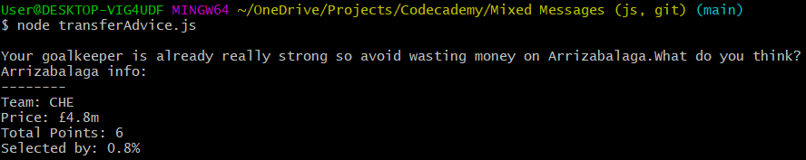

# Mixed Messages (Codecademy Project)

This is a Codecademy project designed to help us practice creating a simple JavaScript program to run on Node.js, use Git and GitHub to track version changes and host the project online.

## Project objectives

We were asked to create a program that creates random messages everytime the user runs it. The theme I chose to create was a random piece of transfer advice for *[Fantasy Premier League](https://fantasy.premierleague.com/)* (FPL).

## Screenshot

Below is an example of output from the transfer advice generator.

## Technologies

- JavaScript
- Node.js
- Git and GitHub

## Setup

Setup is easy! Simply download this repo and run using Node.js from the command line. There are no further dependencies.

## What it demonstrates

The project is used to test and demonstrate our knowledge of some simple JavaScript concepts. Within my code, I have demonstrated usage of:

- Importing data from a seperate JSON file using `require()`.
- Iterating across a large array of objects with `.forEach()`, accessing a certain property and using the `switch` statement to help restructure the data.
- Selecting random indexes in arrays with `Math.floor(Math.random())`.
- Organising my code for others to easily follow by:
  - Spliting code into easy to follow chunks and functions.
  - Extensively, coherently commenting throughout.

### Possible future additions

- Further random advice, such as:
  - When to make the transfer, i.e. on which game-week.
  - When to captain the player they are transfering in.
  - Advice on when to use their *[chips](https://groupscs.co.uk/fantasy-premier-league-chips/)* (free-hits, triple captain, bench-boost, wildcard).
- User inputs their current FPL team:
  - Then the program cross-references the random message with the user's team to exclude recommending a player they already have.
  - Program looks at the the user's team and the points assosciated with each player/position, and therefore selects an appropriate message whether it consider's their team to be good/average/bad. I.e. if the team has a below-average total points for their midfield, recommend transfering in a midfielder with a higher.
